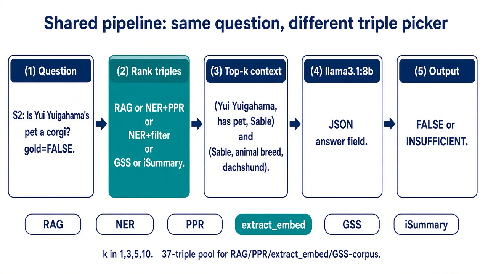
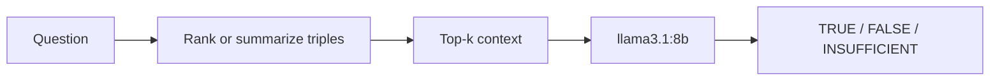
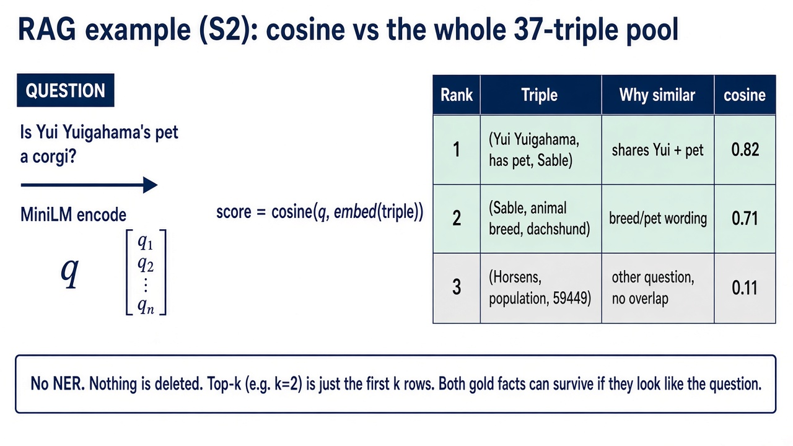
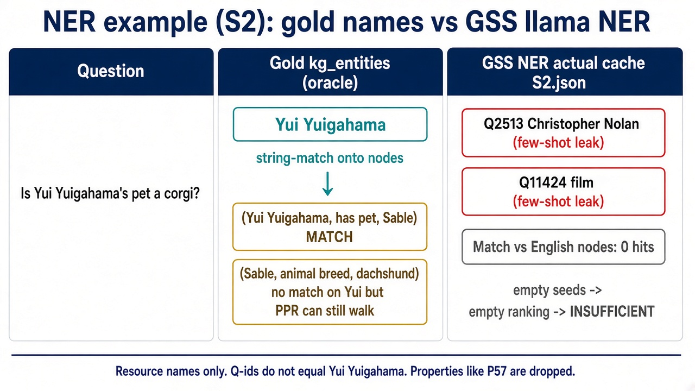
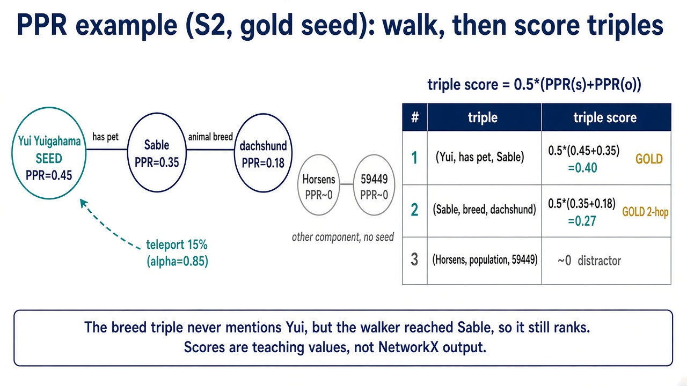
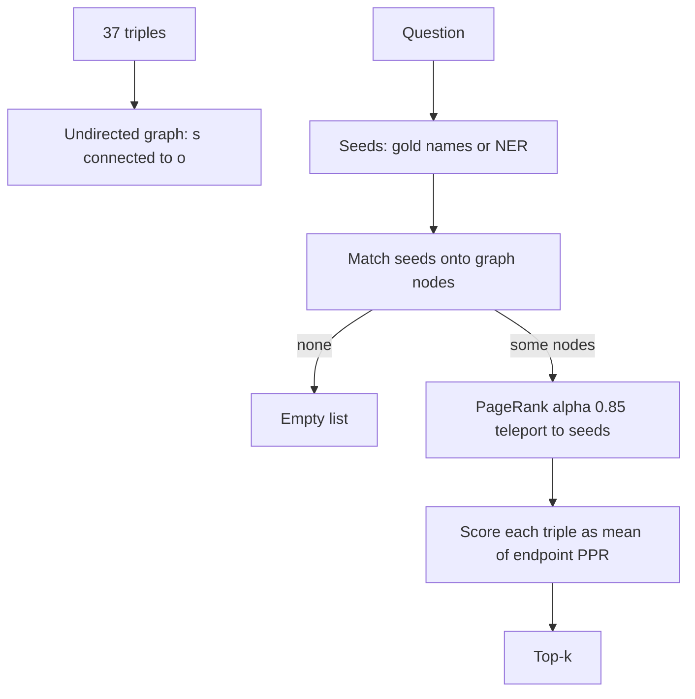
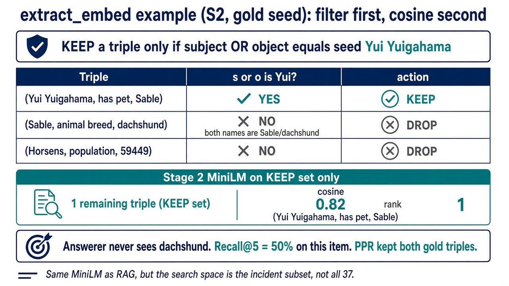
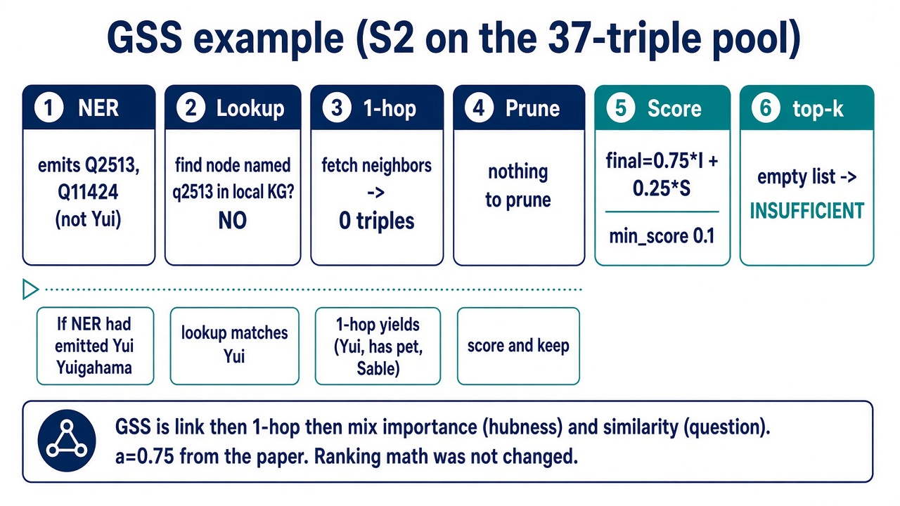
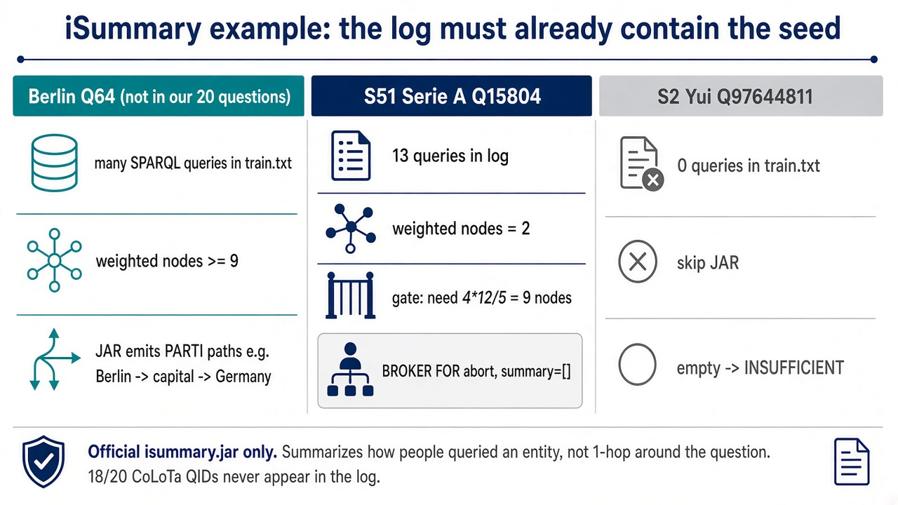
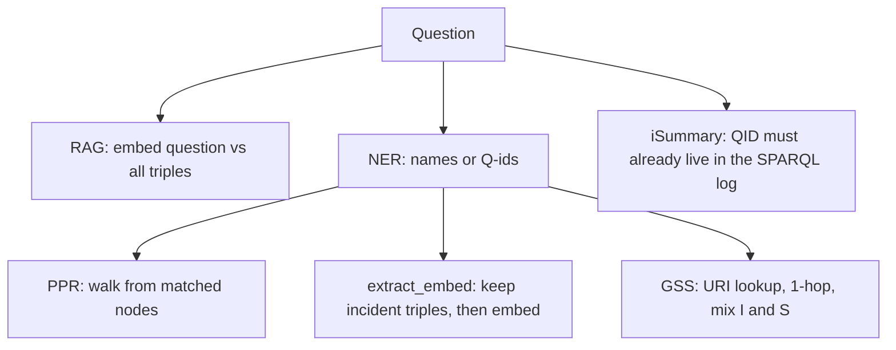

# How the CoLoTa approaches work

A slide-ready explainer for **RAG**, **NER**, **PPR**, **extract_embed**, **GSS**, and **iSummary**.

Each section is one talk block: a picture, the idea in plain language, the actual algorithm we run, then the same toy question worked by hand. Numbers in the hand examples are rounded for teaching; the demo code is what we measured.

**Figures:** `out/colota_demo/presentation/figures/`

---

## 0. What every approach shares



*Figure 1. The S2 question goes through one of six pickers, then the same llama JSON head. Only step (2) changes.*

All six methods are different answers to one job:

> Given a yes/no question, pick a short list of knowledge-graph triples, then ask a small LLM to say TRUE, FALSE, or (for retrievers) INSUFFICIENT.

What does **not** change in the CoLoTa demo:

| Piece | Fixed choice |
|-------|----------------|
| Questions | 20 hand-picked CoLoTa items (`DEMO_IDS`), 10 True / 10 False |
| Answerer | local `llama3.1:8b`, temperature 0, JSON |
| Depths | top-k with k = 1, 3, 5, 10 (report k = 5) |
| Closed fact pool (RAG / PPR / extract_embed / GSS-corpus) | 37 unique gold triples from those 20 items |

What **does** change: **how triples are chosen**.



If the ranker returns nothing, the answerer is told there are no triples and may abstain (`INSUFFICIENT`). We count that as wrong.

---

## 1. One running example (use this on every slide)

**Item S2**

- Question: *Is Yui Yuigahama's pet a corgi?*
- Gold answer: **False** (the pet is a dachshund)
- Gold entity: `Yui Yuigahama`
- Gold triples:

```text
(Yui Yuigahama, has pet, Sablé)
(Sablé, animal breed, dachshund)
```

To answer, the model needs **both** facts: who the pet is, and what breed it is. The breed triple does **not** mention Yui. That 2-hop shape is the whole point of comparing PPR to extract_embed.

A second, even smaller example for RAG/GSS noise:

**Item S1** — *Will Horsens hit 60k before Ikast?* needs two population triples and a numeric comparison. Retrieval can be perfect and the 8B model can still get the comparison wrong.

---

## 2. RAG (MiniLM cosine)



*Figure 2. Teaching cosine ranks on S2. Rows 1–2 are gold; row 3 is a fact from another question. No triples are deleted.*

### Idea

Treat every triple as a **short document**. Embed the question and every document with the same sentence model. Rank by **cosine similarity** (how aligned the two vectors are). No graph, no entity linker.

This is ordinary retrieve-then-generate. On our 37-triple pool it is strong because gold triples reuse the question’s names (*Yui*, *Horsens*, …). Distractors are facts from **other** questions that happen to look similar in embedding space.

### Algorithm (what the code does)

1. Pool the 37 unique gold triples. Encode each with `all-MiniLM-L6-v2` once.
2. Encode the question.
3. Cosine vs **all 37** rows. Sort high to low.
4. Give the top-k lines to llama.

```text
score(triple) = cosine( embed(question), embed(triple text) )
```

There is no seed list. “Yui” is just letters inside the question vector.

### Hand example (S2)

Imagine three triples in the pool (the real pool has 37):

| Triple | Why it matches the question | Toy cosine |
|--------|-----------------------------|------------|
| `(Yui Yuigahama, has pet, Sablé)` | shares *Yui*, *pet* | 0.82 |
| `(Sablé, animal breed, dachshund)` | *pet/breed* related, name *Sablé* | 0.71 |
| `(Horsens, population, 59,449)` | unrelated city | 0.11 |

Top-2 for the answerer:

```text
1. (Yui Yuigahama, has pet, Sablé)
2. (Sablé, animal breed, dachshund)
```

Both gold facts can appear because **nothing was deleted**; they only have to be textually close. On the real 20-item run, RAG Recall@5 was 97.5% and Hits@1 was 100%: at least one gold triple was always rank 1. Accuracy@5 was **70%** — extra triples at k=5 can distract even when the gold facts are present.

### What to say on the slide

- RAG does not know what a node or an edge is.
- It cannot *prefer* 2-hop structure; it can only hope the 2-hop triple still looks like the question.
- It also cannot *exclude* Horsens if that sentence happens to embed nearby.

---

## 3. NER (the shared linking component)



*Figure 3. Left-to-right: the question, the oracle label `Yui Yuigahama`, and the real GSS NER cache (`Q2513`, `Q11424`). Those Q-ids match zero English nodes.*

### Idea

**Named entity recognition / linking** turns the question into a list of **seed names** (or QIDs). Graph methods (GSS, PPR, extract_embed) only look around those seeds.

NER is not an answering approach. It is the **front door**. If the door points at the wrong building, ranking never sees the right triples.

Two seed sources we actually ran:

| Mode | Seeds | Role in the story |
|------|-------|-------------------|
| Gold `kg_entities` | CoLoTa labels (`Yui Yuigahama`) | upper bound: “perfect linking” |
| GSS llama NER | `extract_entities()` resource names | realistic linker, same model as GSS |

### Algorithm (GSS NER, unmodified)

Call the original GSS prompt (`approaches/gss/utils/parser.py`):

1. Few-shot Wikidata examples (US `Q30`, film `Q11424`, director `P57`, GMT board games, Christopher Nolan `Q2513`, …).
2. llama3.1:8b, temperature 0, JSON `{entities: [{name, type, importance}], verbs, synonyms}`.
3. For PPR / extract_embed we keep **`type = resource` only** (drop properties like `P36`).
4. Match names onto English triple subjects/objects (lowercase, `_` → space). `Q11424` ≠ `Yui Yuigahama`.

```text
question  →  llama NER  →  resource names  →  string-match onto KG nodes
```

### Hand example (S2)

**Wanted**

```text
Yui Yuigahama
```

**What GSS NER actually wrote** (from `gss_ner_cache/S2.json`):

```text
Q2513     (Christopher Nolan — copied from the few-shot)
Q11424    (film — copied from the few-shot)
```

Those strings are not nodes in `(Yui Yuigahama, has pet, Sablé)`. Match set = empty → PPR and extract_embed return **no triples** → `INSUFFICIENT`.

**When NER works** (S1): names `Horsens`, `Ikast` come out as English. They match the population triples. Q-id extras (`Q11424`) are ignored because they match nothing.

### What to say on the slide

- Gold-entity PPR at 75% and GSS-NER PPR at 40% are the **same ranker**. Only the door changed.
- Few-shot examples are not harmless. The model copies them.
- RAG does not use NER. That is why unfiltered MiniLM stayed at 70% while NER-gated toys fell to 35–40%.

---

## 4. PPR (Personalized PageRank)



*Figure 4. Gold-seed PPR on S2. Node masses (teaching values) become triple scores \(0.5(\mathrm{PPR}(s)+\mathrm{PPR}(o))\). The dachshund fact ranks even though it does not mention Yui. Horsens is a disconnected distractor.*

### Idea

Ordinary PageRank asks: if you walk the graph at random, where do you spend time? That is **global** fame (hubs).

**Personalized** PageRank adds a bias: with probability \(1-\alpha\) you **teleport back to the query seeds** instead of jumping uniformly. Stationary mass is then “importance as seen from Yui,” not “importance on Wikipedia.”

On a tiny closed graph the walk cannot invent facts. It can only **re-rank edges that already exist**. A triple that does not mention the seed (Sablé → dachshund) can still get mass because the walker reaches Sablé from Yui, then steps onward.

α = **0.85**: 85% follow an undirected edge, 15% jump to a seed.

This is a **toy**. It is not HippoRAG (no documents, no OpenIE).

### Algorithm (what the code does)

1. Parse each of the 37 triples as `(s, p, o)`.
2. Build an **undirected** graph on **subjects and objects only**. Predicates are not nodes. Each triple becomes an edge `s — o`.
3. Seeds = graph nodes whose names match the seed list (gold labels or GSS NER).
4. If no seed hits a node: empty ranking.
5. NetworkX `pagerank` with equal personalization `1/|seeds|` on the matched nodes.
6. Triple score = average of its two endpoints:

```text
score(s, p, o) = 0.5 × (PPR(s) + PPR(o))
```

7. Sort all 37 triples by that score. Top-k go to llama.



### Hand example (S2, gold seed)

Graph (plus one distractor from another question):

```text
Yui Yuigahama —— Sablé —— dachshund

Horsens —— 59,449     (separate component)
```

Seed = `{Yui Yuigahama}`.

Toy walk (not the exact NetworkX output, order is what matters):

| Node | Why it has mass | Toy PPR |
|------|-----------------|---------|
| Yui Yuigahama | seed; walker keeps returning here | 0.45 |
| Sablé | only neighbor of the seed | 0.35 |
| dachshund | one step past Sablé | 0.18 |
| Horsens / 59,449 | no seed in that component | ≈ 0 |

Triple scores:

| Triple | 0.5 × (PPR(s)+PPR(o)) |
|--------|------------------------|
| `(Yui Yuigahama, has pet, Sablé)` | 0.5 × (0.45+0.35) = **0.40** |
| `(Sablé, animal breed, dachshund)` | 0.5 × (0.35+0.18) = **0.27** |
| `(Horsens, population, 59,449)` | ≈ **0** |

Top-2 still contains **both** gold facts, including the 2-hop breed triple. That is the PPR selling point.

With **GSS NER** on S2, seeds are `Q2513` / `Q11424` → no matched nodes → empty list.

### What to say on the slide

- PPR is “start at the entity, leak probability along edges.”
- 2-hop evidence can survive.
- Isolated distractors stay near zero **if** the seed is right.
- If the seed is a leaked Q-id, the walk never starts.

Demo: gold-seed PPR **75%** @k=5 (Recall 97.5%, MRR 1.0). GSS-NER PPR **40%** (Hits 45%).

---

## 5. extract_embed (entity filter + MiniLM)



*Figure 5. Same S2 gold seed. The breed triple is dropped because neither `Sablé` nor `dachshund` is the seed. MiniLM then ranks a KEEP set of size 1. Recall@5 = 50% on this item.*

### Idea

Two stages, like many KG-RAG papers:

1. **Extract / link** — which nodes is this question about?
2. **Embed** — among triples that *touch* those nodes, who is closest to the question text?

The hope: drop Horsens when the question is about Yui. The cost: any gold triple whose **subject and object are both not seeds** is deleted forever. Embeddings cannot resurrect it.

This is a **toy**. It is not G-Retriever (no Steiner tree) and not HippoRAG.

### Algorithm (what the code does)

1. Encode the full 37-triple corpus with the **same MiniLM** as RAG (once).
2. Seeds = gold `kg_entities` or GSS NER resource names (same helper as PPR).
3. Keep a triple iff **s or o** matches a seed. Predicates are not matched.
4. If the kept set is empty: empty ranking.
5. Cosine(question, **kept rows only**). Sort that subset. Top-k → llama.

```text
keep(triple) = s in seeds  OR  o in seeds
score(triple) = cosine(embed(question), embed(triple))   # on kept rows only
```

### Hand example (S2, gold seed `Yui Yuigahama`)

| Triple | Touches Yui? | Fate |
|--------|--------------|------|
| `(Yui Yuigahama, has pet, Sablé)` | yes (subject) | **KEEP** |
| `(Sablé, animal breed, dachshund)` | no | **DROP** |
| `(Horsens, population, 59,449)` | no | DROP |

The answerer only sees the pet name, not the breed. Recall@5 on S2 in the gold-seed run was **50%**. PPR on the same item was **100%**.

With **GSS NER** on S2, seeds are Q-ids → keep-set empty → `INSUFFICIENT`.

### What to say on the slide

- Same MiniLM as RAG, **smaller search space**.
- Cleaner lists when linking is good (gold-seed extract_embed **75%**, even beating RAG@5).
- Hard ceiling: gold-seed Recall never exceeded **86.7%**, no matter how large k was.
- Same NER as PPR ⇒ same empty items; slightly worse recall because 2-hop gold is gone.

Demo: gold-seed **75%** @k=5. GSS-NER **35%**.

---

## 6. Put PPR and extract_embed on one slide

Same question, same gold seed, different geometry:

```text
Yui  —has pet→  Sablé  —breed→  dachshund
```

| | PPR | extract_embed |
|---|-----|----------------|
| Sees the graph? | yes (undirected) | no, only a name filter |
| `(Yui, has pet, Sablé)` | high (seed endpoint) | kept, then cosine |
| `(Sablé, breed, dachshund)` | still scored (walk reached Sablé) | **deleted** |
| Horsens triple | ~0 if no seed there | deleted |

**Talking line:** PPR *spreads*; extract_embed *clips*. RAG *compares sentences* and never clips.

---

## 7. GSS (Graph Summarization Scoring)



*Figure 6. Top row is what GSS actually does on S2 with NER leakage (empty subgraph). Bottom row is the counterfactual if NER had emitted `Yui Yuigahama`.*

### Idea

GSS builds a **query-focused subgraph** from a live KG (or, in one demo, from the same 37 triples):

1. Link the question (NER).
2. Walk **one hop** around those URIs (not a multi-hop PPR walk).
3. Score remaining triples as a mix of **importance** (structural hubness) and **similarity** (relatedness to the question).
4. Keep a short summary, then answer.

Paper mixing weight **a = 0.75**:

```text
final_score = 0.75 × importance + 0.25 × similarity
```

Importance answers “is this a central node in the neighborhood?” Similarity answers “does this triple look like the question?” The mix is meant to avoid dumping the entire 1-hop star of a famous entity.

### Algorithm (restored pipeline, ranking math not changed)

```text
question
  → GSS llama NER
  → lookup each name to a URI (Wikidata SPARQL, or label match on the 37-pool)
  → fetch triples around those URIs
  → expand 1-hop
  → prune bad URIs
  → importance from degrees / NER weights
  → similarity vs the question
  → final = a×I + (1−a)×S
  → drop triples with final < 0.1
  → top-k to llama
```

Two knowledge sources we ran:

| Run | KG | Typical context |
|-----|----|-----------------|
| Live Wikidata | `query.wikidata.org` | URI triples, leaked Q30/Q11424 neighborhoods, 504s |
| Corpus | same 37 English triples as RAG | empty graph if NER names are not in the pool |

Empty subgraph (NER miss, or min-score wipeout) → `INSUFFICIENT`.

### Hand example (S2, corpus KG)

1. NER emits `Q2513`, `Q11424` (see §3).
2. Local lookup looks for nodes named `q2513` / `q11424` in `(Yui Yuigahama, has pet, Sablé)`.
3. No match → fetch returns nothing → summary `[]`.
4. Answerer abstains.

**When NER hits English names** (S1 Horsens / Ikast, or S175 Lee Hyori): 1-hop on the 37-graph is often just the gold triples themselves. Then GSS ranking is easy (first gold at rank 1). The bottleneck is still step 1.

### What to say on the slide

- GSS is **link → 1-hop → mix I and S**, not cosine over a document list.
- We did **not** rewrite the ranker. Failures on this slice are mostly NER leakage and URI-only context (live Wikidata).
- Corpus GSS @k=5 = **40%**, same ballpark as PPR/extract_embed once they use the same NER.

---

## 8. iSummary (log-based selective summary)



*Figure 7. Three real cases: Berlin (log-heavy, summary exists), S51 Serie A (13 queries but 2 nodes < 9 → BROKER abort), S2 Yui (0 queries → skip JAR).*

### Idea

iSummary (Vassiliou, Papadakis, Kondylakis, SWJ 2025) does **not** read the question as a graph walk. It builds a **(λ, κ)-selective summary from a SPARQL query log**.

Intuition: people keep asking similar queries about **Berlin**. The log around Berlin is a good city summary. Nobody in that log asked about Yui Yuigahama, so there is **no workload** to compress.

We wrap the **official JAR** only (`java -jar isummary.jar`). No Python reimplementation of Algorithm 1.

### Algorithm (as we invoke it)

1. Take the first CoLoTa `kg_entities` QID that appears in the authors’ Wikidata `train.txt` (~154k queries).
2. If none appear: skip the JAR, empty summary.
3. Write a 2-line ranking file with that URI first (`choose_from` must be ≥ 2).
4. Run `isummary.jar testdata train.txt nodes top_k choose_from` with κ / top_k = 12.
5. Original size gate: if the weighted node set is smaller than `4 × 12 / 5 = 9`, abort (`BROKER FOR`).
6. Parse `---------- PARTI` paths from stdout. Variable resolution is log-only (no SPARQL endpoint).
7. Empty → `INSUFFICIENT`.

```text
seed QID in log?  --no-->  empty
       |
      yes
       v
weighted nodes >= 9?  --no-->  BROKER abort
       |
      yes
       v
PARTI paths from frequent query patterns
```

### Hand example

**Berlin (Q64)** — not in our 20 questions, but frequent in the paper log. Many `SELECT` patterns share Berlin. The JAR emits PARTI paths (capital, country, …). That is a real summary.

**S2 Yui (`Q97644811`)** — **0** mentions in `train.txt`. Skip JAR.

**S51 Serie A (`Q15804`)** — 13 log hits, but only 2 weighted nodes < 9 → original `BROKER FOR`. Still empty.

**S160 Tehran (`Q3616`)** — 1 log hit, Jena parse 0. Still empty.

On the 20-item slice, 18/20 QIDs never appear in the log. Accuracy@5 was **10%** (two Gold-False guesses on empty context). Recall vs English gold triples was **0**: the JAR speaks SPARQL URIs, not `(Yui Yuigahama, has pet, Sablé)`.

### What to say on the slide

- iSummary summarizes **how people queried** an entity, not **what the KG contains around the question**.
- Long-tail CoLoTa seeds are the wrong workload for the paper’s Wikidata log.
- Empty output is the official system on this slice, not a wrapper bug. Berlin still works.

---

## 9. One picture of how they differ



| Approach | Needs NER / seeds? | Uses the graph? | Can keep 2-hop gold? | Typical failure on this demo |
|----------|--------------------|-----------------|----------------------|------------------------------|
| RAG | no | no | yes, if text is similar | distractors at large k |
| NER | — | — | — | few-shot Q-id leakage |
| PPR | yes | yes (undirected) | **yes** | wrong/empty seeds |
| extract_embed | yes | 1-hop filter only | **no** | filter drops breed/occupation hops |
| GSS | yes (own NER) | 1-hop + scores | only if the hop is fetched | leakage, empty local match, URI context |
| iSummary | QID in a **log**, not a graph | no live KG walk | only if the log has those paths | seed absent / BROKER abort |

---

## 10. Numbers you may want on the last slide (k=5, n=20)

| Method | Accuracy | What it isolates |
|--------|----------|------------------|
| Gold triples (oracle list) | 90% | reasoning ceiling |
| PPR, gold names | 75% | ranking if linking is perfect |
| extract_embed, gold names | 75% | filter+cosine if linking is perfect |
| MiniLM RAG | 70% | no linker |
| LLM-only | 50% | parametric memory |
| GSS live Wikidata | 50% | original GSS on SPARQL |
| GSS on 37 triples | 40% | GSS + same NER, closed KG |
| PPR, GSS NER | 40% | PPR + **same** NER |
| extract_embed, GSS NER | 35% | filter+cosine + **same** NER |
| iSummary official JAR | 10% | log summary on this slice |

**Line for the talk:** *When we give the toys gold entity names, they look better than GSS. When we give them GSS’s own NER, they look like GSS. RAG never needed NER and stayed in the middle.*

---

## 11. Suggested slide order

1. Shared pipeline (figure 01)  
2. S2 gold facts on the blackboard  
3. RAG (figure 02) + cosine table  
4. NER (figure 03) + S2 cache `Q2513` / `Q11424`  
5. PPR (figure 04) + walk scores  
6. extract_embed (figure 05) + KEEP/DROP  
7. PPR vs extract_embed on the same 2-hop chain  
8. GSS (figure 06) + the mix formula  
9. iSummary (figure 07) + Berlin vs Yui  
10. Comparison table + k=5 numbers  

Code pointers if someone asks:

- RAG: `src/colota_demo/approaches/rag_transformers/`
- NER cache helper: `src/colota_demo/utils/gss_ner.py` (calls GSS `extract_entities`, does not change GSS ranking)
- PPR: `src/colota_demo/approaches/ppr/`
- extract_embed: `src/colota_demo/approaches/extract_embed/`
- GSS: `src/colota_demo/approaches/gss/pipeline/pipeline.py`
- iSummary JAR wrap: `src/colota_demo/approaches/isummary/`
